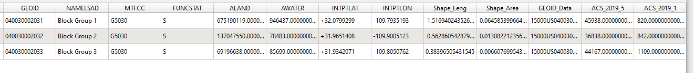
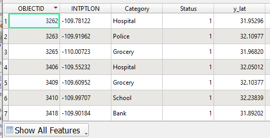
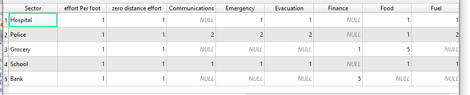
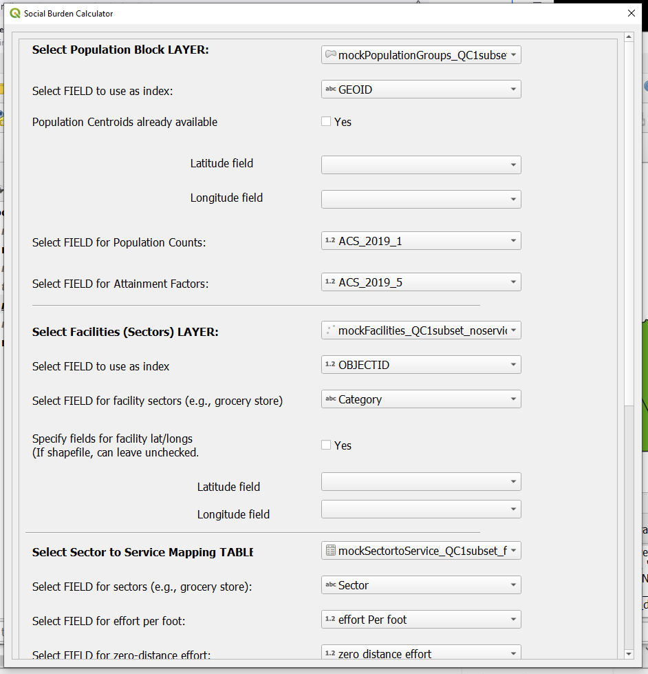

# QGIS-plugin

## Name
QGIS Social Burden plugin

## Description

### What is Social Burden?
Social infrastructure service burden (abbreviated “Social Burden”) refers to the effort people must expand to meet their daily needs relative to their ability to perform this activity. It helps answer the question of how equitably (or inequitably) critical services are available across an area of interest, considering not only the location and quality of the available services, but also their availability to more vulnerable individuals within the community.
 
Social Burden considers the full “basket” of people’s day-to-day needs that are critical for sustaining ongoing physical and mental well-being. These services include access to adequate food, clean water, shelter, fuel, medical care, financial services, communications, emergency logistics, evacuation, transportation, waste management, and other services. These are services that are provided by (or dependent on) the continued operation of infrastructure outside of the home. For example, access to clean water depends on the continued operation of pumping wells, water treatment facilities, and the pipes supplying water to homes, or, to the operation of stores selling bottled water.  

In energy planning, Social Burden is being used as an equity and resilience metric, helping communities better understand and be able to communicate to others the full implications of power outages, and the resiliencies (or redundancies) built into the energy system or the community’s infrastructure/services.

In other contexts (such as urban planning), social burden can be used as a quantitative measure of the availability, and the equity in access, of critical infrastructure and services. It can help inform equitable siting or zoning decisions and provide an interface to other emergency and resilience planning efforts. 

For more information on Social Burden, refer to the 2022 Social Burden white paper by Wachtel et al., available for free public download at: https://www.osti.gov/biblio/1846088.

### Plugin Description

This plugin calculates Social Burden scores, both aggregated and disaggregated, across different critical service types (e.g., food, water, medical care, shelter, etc.) and population groupings (e.g., per-capita, per population sub-group, per study area). Results are output in both tabular and geospatial formats. This plugin can also generate auto-formatted JSON input files for follow-on optimization using the Resilient Node Cluster Analysis Tool (ReNCAT). For more information about ReNCAT, refer to the 2022 ReNCAT white paper by Wachtel et al, available for download at: https://www.osti.gov/servlets/purl/1880920). 

###  Suitable Applications for the QGIS Social Burden Plugin

The Social Burden plugin can be used to identify “hotspots” of need in a community, broken down by food access, medical care, and any other relevant services.

By modifying the inputs to design different hypothetical configurations of people, facilities, and services, it can also be used to test “what if” scenarios, and answer questions like:

* Where should I locate a new community clinic so that the medical services it provides can be allocated in the most equitable and least redundant (most impactful) way? 

* Which existing facilities are the most important to keep up and running? During a grid outage, which facilities are most important to provide redundant power to (e.g., backup generators, microgrids, etc)?

* What impact would a power outage have on my community? How does social burden differ between the day-to-day when all facilities are operating as usual ("blue sky"), and emergency scenarios when some facilities are down and the power is out ("black sky")?

## Terminology

A glossary of commonly used terms, and their specific meaning within the context of social burden calculation and the QGIS plugin, is provided below: 

###  attainment factor

The attainment factor describes the relative ability of a given group in the community to acquire critical services (ability to travel, ability to pay, ability to spend time, etc.). The attainment factor is used to represent that two people traveling the same distance to the same facility to obtain the same service may experience different degrees of difficulty based on their ability to physically travel, spend time traveling and waiting at the facility, and spend money to purchase the service. Household median income is frequently used as a proxy for attainment ability. 

###  effort per foot 

The effort per foot is an estimate of the additional effort that is required to traverse each additional foot of distance traveled to facilities.  

###  exclusion profile

An exclusion profile is an optional parameter. An exclusion profile is a polygon that reduces the level of service at facilities that fall within its boundaries, or entirely excludes (removes) them from the analysis. The exclusion profile can be used to simplify setting up “black-sky” analyses, by specifying certain polygons within the study area in which the power is out. It can also be used to represent areas of likely hazards, like flooding, and evaluate the impacts to social burden if the facilities falling within the flood zones are unreachable to the population, whether or not they have power.

###  facility

A facility is a specific instance of infrastructure (most commonly, a specific building) where people can go to acquire one or more of their critical services. “ABC Grocery on the corner of Main Street and 48th Avenue” is an example of a facility. A facility is a single, specific instance of some sector. In other words, “ABC Grocery on the corner of Main Street and 48th Avenue” is a single, specific instance of “grocery stores.” Each facility belongs to only one sector. 

###  population group

A population group is the smallest (most granular) unit of measurement of a study area’s entire population. All individuals within a population group will be treated the same and will have the same social burden scores. Travel distances to facilities and services are calculated from the centroid of the population group polygons. There are no mechanistic limits on the upper or lower bound of the size of a population group. Practically, census block groups are frequently used as population groups, because U.S. Census data on population counts and median household incomes are available at that reporting level. However, population groups can be smaller (e.g., individual households) or larger (e.g., census tracks) depending on the data available. 

###  sector

A sector is a class or type of facility, e.g. “grocery stores,” or even "large grocery stores" vs "small grocery stores" are examples of sectors. Many facilities can belong in one sector. 

###  (critical) service

A (critical) service represents a category of human need, such as food, water, medical care, communications, and financial services. Although the list of relevant services can be tailored by the user to fit the project needs, the overall intent of critical services is to represent people’s day-to-day needs that are critical for sustaining ongoing physical and mental well-being, and that are provided by infrastructure. 

###  service level

The level of service, on a scale of 0 to 5, identifies how much of a given critical service (e.g., food, water, medical care, etc.) is available to serve the entire study area’s population for the entire time of interest. A service level of 0 indicates no service is provided. For example, a gas station does not provide medical care, and its service level in that category would be 0. A service level of 1 indicates very low service. For example, a gas station may sell some first aid supplies, but the amount and range of products is very limited and would run out quickly trying to meet the needs of the entire town. A service level of 5 indicates very high service. It is usually reserved for situations in which the entire community’s needs can be met for the duration of the study period – e.g., a cell phone tower providing communications service indefinitely as long as it remains operational. 

###  weight

The weight refers to the relative weight to assign to a particular population group, when aggregating social burden. Most commonly the results are weighted by population, so the weight refers to the population in each population group. 

### zero-distance effort

Level of effort required to obtain services from a given sector even when no distance is traversed.

## Installation

This plugin was designed and tested in Windows QGIS 3.28 and 3.30. Some early design was done in QGIS 3.22. No guarantees are given about compatibility with editions 2.x of QGIS, editions later than 3.30 or earlier than 3.22, or editions not run on Windows. Multiple editions of QGIS can be installed on the same machine simultaneously.

NEW! The Social Burden plugin is now now live on the QGIS Python Plugins Repository. It references the latest github version of the plugin code. 
As part of the QGIS Python Plugins Repository, the QGIS Social Burden Plugin can now be accessed and installed directly within QGIS. To load the Social Burden Plugin directly in QGIS:
Step 1: Launch QGIS.
Step 2: In the "Plugins" menu, go to "Manage and Install Plugins".
Step 3: On the left-hand side of the resulting popup menu, click "All".
Step 4: Type "Social Burden Calculator" in the search bar.
Step 5: Click to select "Social Burden Calculator" from the dropdown list.
Step 6: Click "Install Plugin".
This installs the plugin. 

The Social Burden plugin can also be downloaded from the QGIS Python Plugins Repository at: [QGIS Python Plugins Repository](https://plugins.qgis.org/plugins/QGIS-social-burden-plugin-main/).
Follow the installation instructions below to install from ZIP.

Alternatively, installation can be performed from the github page:

Step 1: Download this repository as a zip file. Or, git clone it and zip the resulting directory.

Step 2: If QGIS is not already open, open it.

Step 3: In the "Plugins" menu, go to "Manage and Install Plugins".

Step 4: On the left-hand side of the resulting popup menu, click "Install from ZIP".

Step 5: Click the "..." button on the right-hand side of the "ZIP file" path box, navigate to the zip file with the downloaded plugin, and select it/hit ok.

Step 6: Click "install plugin".

This installs the plugin.

## Usage 

###   Inputs

This plugin relies on a minimum of 3 items: 
1. population group information, including: 
	* indexing column or other set of unique identifiers for each population group
	* location (specified latitude and longitude, or polygon shapefile in lat/long CRS) 
	* 'weight' (usually population count)
	* 'attainment factor' (how much they have in resources; currently attainment factor must be a scalar for each population group).
	
	Ideally this file is a shapefile.
2. facility information, including: 
	* indexing column or other set of unique identifiers for each facility
	* location (latlong or point geography in lat/long crs)
	* sector (e.g., "grocery store")
	
	Ideally this information comes as a shapefile or table.
3. a table mapping sectors to service levels and effort, including: 
	* each sector, such as gas station, to the level of service it provides for each service of interest, such as 'fuel'. (0-5, usually; decimals ok; must be numeric)
	* each sector, such as gas station, to the level of effort required per foot to reach that sector. That is, for each extra foot of distance traveled to facilities of that sector, how much extra effort does it require? (decimals ok.)
	* each sector, such as gas station, to the level of effort required to visit that sector even if no distance is traversed (decimals ok.)
	
Optional items: 

1. Inputs
* An exclusion layer: a shapefile layer indicating geographical areas where facilities falling inside that area suffer degraded services. There is also the option to describe what percentage degradation all facilities in this exclusion layer experience (0-100).

2. Outputs
* CSV write-out of results, both aggregated and per population unit. Both are required if outputs are requested.
* JSON write-out of inputs, formatted for inputting into ReNCAT.
* JSON write-out of results, formatted in the same way as ReNCAT results are formatted.

###   Input formatting
1. Population group information
	
	

	The above image shows an example set of population groups and some information about them. Not all this information is used. In our example below, we will be using the 'GEOID' (as index), 'ACS_2019_5' (median income in the 2019 American Community Survey), and 'ACS_2019_1' (population in the 2019 ACS community survey) fields. Other data fields do not need to be scrubbed prior to social burden analysis, but will not be used in the calculations.

2. Facility information

	

	The above image shows an example set of facilities from a shapefile, and some information about them. Not all this information is used. In our example below, we will be using the "OBJECTID" (as index) and "Category" (indicating the facility's sector) columns.

3. Sector to service mapping table

	

	The above image shows an example sector to service mapping table. Each row describes one sector, and each column describes some information about that sector. All columns will be used. Note the special columns "zero-distance effort" and "effort per foot", which represent the effort required to visit facilities of this sector even if no travel is required, and the effort required for each foot of travel between the population group's centroid/location and the facilities of that sector, respectively.

Service levels for a given sector may be null, in which case they are treated as zeros. A higher service level means that facilities of that sector provide a higher level of service. Other than null, service levels must be numeric data (not strings).

If the effort or service levels are intended to be different for each facility, then each facility should be treated as its own sector, and its service levels and efforts should be treated accordingly.

	

4. Exclusion layer (optional)

	An exclusion layer is a shape or other geographic layer that can be overlaid or intersected with the set of facilities in order to determine which facilities should have their service levels degraded. At this time, only one exclusion layer, and only a single service degradation percentage (0-100), are supported.

## Using the plugin menu

1. Go to Plugins > Social Burden Calculator > Social Burden Calculator

2. The resulting popup menu should look like this (note that the screencap cuts off the bottom of the menu): 

	

	Although the layer and field names may differ depending on the layers available and the fields contained therein. 
	
3. Population information: 

	1. Select the population block layer in the dropdown.
	
	2. Select the field in the population layer that represents the index column of the population. Index values should be unique.
	
	3. To specify centroid values from fields in the layer, 
		mark "yes" for "population centroids already available" and specify the fields containing the latitude 
		and longitude values of the population centroids. If "yes" is left unchecked, 
		the dropdowns for the latitude and longitude fields will be ignored. 
		
		This option need not be used if population groups are represented using a polygon layer.
		
	4. In "Select FIELD for Population Counts," select the field indicating the weight (population, number of people) of each population group.
	
	5. In "Select FIELD for Attainment Factors," select whatever field is being used to indicate the population group's abilities or attainment factor (usually this is income).
	
4. Facilities information: 

	1. Select the layer containing the facilities information.
	
	2. Select the field that acts as the index for the facilities. Index values should be unique, 
		but in _theory_ they could be the 
		same as the index values for the population groups (this has not been rigorously tested).
		
	3. Select the field that represents each facility's category.
	
	4. If the facilities' lat-longs have to be explicitly defined 
		(e.g., if the facility layer is a table rather than from a shapefile), click "yes" for "specify fields for lat/longs". 
		Use the dropdown fields to specify the fields that describe the facilities' latitudes and longitudes. If yes is not clicked, 
		these fields will be ignored.
		
5. Sector to service mapping table: 
	
	1. Select the layer containing the sector to service mapping table.
	
	2. Select which field name contains the sector names.
	
	3. Select which field represents sector factilites' effort per foot.
	
	4. Select which field represents sector facilities' zero-distance effort, 
		the effort required even if visiting facilites of that sector requires no travel.
	
6. (optional) Exclusion layer: 

	1.  If an exclusion profile is to be used, select "yes". If "yes" is not selected, 
		the remaining fields in this section are ignored.
	
	2. Select the layer that contains the exclusion profile geometry.
	
	3. Type in or use the up-down arrows at the right of the box to 
		specify the percent reduction of service to facilities that lie in the exclusion zone. 
		This value is limited between 0 and 100. If service reduction is 0 (0%), then service
		is the same as if the facility did not lie in the exclusion zone. If service reduction is 100 (100%), then
		the facilities in the exclusion zone cannot provide any services.
		
7. (optional) Export output to CSV: 

	1. If output should be automatically exported to CSV, select "yes". If "yes" is not checked, then
		any exporting of the results of the calculations will have to be done manually. A
		shapefile layer is generated by the plugin regardless of whether the CSV export is selected, but 
		the layer is temporary and has to be saved manually. The shapefile layer that is loaded into QGIS will 
		be temporary, regardless of whether the results are exported.
		
		If the box is not checked, the remaining fields in this section are ignored.
		
	2. For the output that breaks down burden for each population group, select an output path.
	
	3. For the output that aggregates burden across all the population groups, select an output path.
	
8. (optional) Export as ReNCAT input: 

	ReNCAT is a command-line tool for calculating social burden, but it has different formatting requirements
	than this plugin. If desired, 
	after burden is calculated, the parameters used by the plugin to calculate social burden can be exported 
	as ReNCAT input files.
	
	1. If a ReNCAT input file should be generated, click 'yes'. If the box is not checked, the 
	remaining fields in this section are ignored.
	
	2. Provide a path or filename to which to save the ReNCAT input file. 

9. (optional) Export results in the same format as ReNCAT results: 

	ReNCAT is a command-line tool for calculating social burden, but it formats its results differently, and 
	does not include in its results all the elements that this plugin does. ReNCAT results files 
	are JSON files with a specific structure. If desired,
	after burden is calculated, the plugin results can be exported in the same structure as 
	ReNCAT results JSON files are formatted.
	
	
	1. If a ReNCAT-style results file should be generated, click 'yes'. If the box is not checked, the 
	remaining fields in this section are ignored.
	
	2. Provide a path or filename to which to save the ReNCAT-style results file. 
	
	
9. Select "OK".

Input locations must be in a lat/long CRS, such as EPSG 4269, otherwise results
will be nonsensical.

Due to I/O issues, the plugin does not run instantaneously.
For a problem size of roughly 1000 population groups, 
6500 facilities, and 16 infrastructure types, 
the plugin takes roughly 2 minutes to run on the developers' 
computers. QGIS may appear to freeze while the plugin is running.
	

To insert the resulting calculated burden values into a map, we suggest using the 
built-in "Join attributes by field value" processing algorithm, using your polygon layer 
(the geographic layer) as the input layer and using the calculated burden 
values as input layer 2.

QGIS 3.28 documentation of that algorithm: https://docs.qgis.org/3.28/en/docs/user_manual/processing_algs/qgis/vectorgeneral.html#join-attributes-by-field-value

A helpful tutorial: https://www.qgistutorials.com/en/docs/3/performing_table_joins.html (see step 15)

## Roadmap
If you are able to read this README, and there are features you'd like added, other changes, or suggested applications, let the corresponding developer know.

## Authors and acknowledgment

Authors: 

Olga Hart, oehart@sandia.gov *

Emily Moog, ermoog@sandia.gov

Acknowledgements: 

Cyndy Bresloff

Thad Haines, jthaine@sandia.gov

Will Vining , wfvinin@sandia.gov

*Corresponding developer

## Project status
As of June 2023, version 1.0 of this plugin is finalized. Additional development may occur pending project needs.
